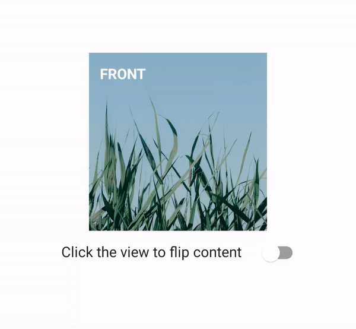

# FlipperLayout for Jetpack Compose
Jetpack Compose version of [FlipperControl for UWP](https://github.com/JuniperPhoton/FlipperControlUWP) and [FlipperView for Android](https://github.com/JuniperPhoton/FlipperLayout).

A composable that uses flip transition to change two states: front and back.



## How to use

> Currently you had to copy the source file `FlipperLayout.kt` to your project and make it work. Since it's quite simple I have no plan to publish to maven.

It's as simple as Jetpack Compose is:

First, define your composable function with your own content. Here we hoist event so this composable function is for displaying the right state.

```
@Composable
fun FlipperContent(
    flipperSide: FlipperLayoutSide,
    onFlipperSideChanged: () -> Unit
) {
    FlipperLayout(
        modifier = Modifier.clickable {
            onFlipperSideChanged()
        },
        flipperSide = flipperSide,
        animationSpec = tween(300)
    ) {
        val text = if (it == FlipperLayoutSide.Front) "Front" else "Back"
        Box(
            Modifier
                .fillMaxWidth(0.5f)
                .aspectRatio(1f)
        ) {
            Image(
                painter = painterResource(
                    if (it == FlipperLayoutSide.Front) {
                        R.drawable.image0
                    } else {
                        R.drawable.image1
                    }
                ),
                contentDescription = text,
                contentScale = ContentScale.Crop
            )
            Text(
                text.uppercase(),
                modifier = Modifier.padding(12.dp),
                fontWeight = FontWeight.Bold,
                color = Color.White
            )
        }
    }
}
```

Then we remember and control the state:

```
var flipperSide by remember {
    mutableStateOf(FlipperLayoutSide.Front)
}

FlipperContent(flipperSide) {
    flipperSide = flipperSide.flip()
}
```

And that's it!